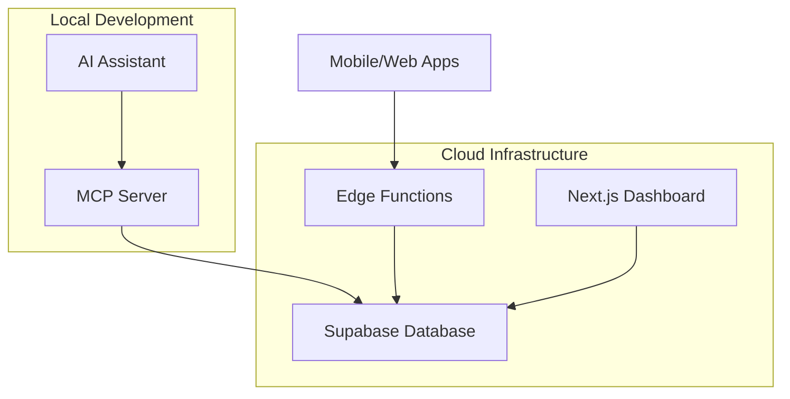

# 🏦 Loan Tracker MCP

A comprehensive loan management system with AI integration, featuring a beautiful dashboard, cloud-based Edge Functions, and Model Context Protocol (MCP) integration for natural language interactions.


## ✨ Features

- **🎨 Beautiful Dashboard** - Modern, responsive UI with real-time loan progress tracking
- **🤖 AI Integration** - Natural language loan management via MCP (Model Context Protocol)
- **☁️ Cloud Functions** - Serverless Edge Functions for global accessibility
- **📊 Visual Analytics** - Progress gauges, payment trends, and contribution tracking
- **👫 Multi-User Support** - Track payments from Steven & Katerina
- **📱 Mobile Ready** - Responsive design works on all devices
- **🔒 Secure** - Row Level Security with Supabase authentication
- **⚡ Real-time** - Instant updates across all components

## 🏗️ Architecture



### Components

- **MCP Server** (`src/`) - Local AI integration for natural language commands
- **Edge Functions** (`supabase/functions/`) - Cloud-based API endpoints
- **Dashboard** (`dashboard/`) - Beautiful Next.js frontend
- **Database** (Supabase) - PostgreSQL with Row Level Security

## 🚀 Tech Stack

- **Frontend**: Next.js 15, TypeScript, Tailwind CSS, Recharts
- **Backend**: Supabase Edge Functions (Deno), PostgreSQL
- **AI Integration**: Model Context Protocol (MCP)
- **Deployment**: Vercel (Dashboard), Supabase (Edge Functions)
- **Styling**: Tailwind CSS with beautiful gradients and animations

## 📋 Prerequisites

- Node.js 18+ (20+ recommended for Supabase)
- Supabase account and project
- Git and GitHub account
- Vercel account (for deployment)

## ⚡ Quick Start

### 1. Clone & Install

```bash
git clone https://github.com/stozo04/loan-tracker-mcp.git
cd loan-tracker-mcp
npm install

# Install dashboard dependencies
cd dashboard
npm install
cd ..
```

### 2. Environment Setup

Create `.env` in project root:
```env
SUPABASE_URL=your_supabase_project_url
SUPABASE_ANON_KEY=your_supabase_anon_key
```

Create `dashboard/.env.local`:
```env
NEXT_PUBLIC_SUPABASE_URL=your_supabase_project_url
NEXT_PUBLIC_SUPABASE_ANON_KEY=your_supabase_anon_key
```

### 3. Database Setup

```sql
-- Create loans table
CREATE TABLE loan_tracker_loans (
  id uuid PRIMARY KEY DEFAULT gen_random_uuid(),
  name text NOT NULL,
  original_amount decimal(10,2) NOT NULL,
  current_balance decimal(10,2) NOT NULL,
  loan_type text NOT NULL,
  term_months integer NOT NULL,
  loan_date date NOT NULL,
  created_date date NOT NULL DEFAULT CURRENT_DATE,
  created_at timestamp DEFAULT now()
);

-- Create payments table
CREATE TABLE loan_tracker_payments (
  id uuid PRIMARY KEY DEFAULT gen_random_uuid(),
  loan_id uuid REFERENCES loan_tracker_loans(id) ON DELETE CASCADE,
  amount decimal(10,2) NOT NULL,
  paid_by text NOT NULL,
  payment_date date NOT NULL,
  created_at timestamp DEFAULT now()
);

-- Enable Row Level Security
ALTER TABLE loan_tracker_loans ENABLE ROW LEVEL SECURITY;
ALTER TABLE loan_tracker_payments ENABLE ROW LEVEL SECURITY;

-- Create policies
CREATE POLICY "Allow all operations on loans" ON loan_tracker_loans FOR ALL USING (true);
CREATE POLICY "Allow all operations on payments" ON loan_tracker_payments FOR ALL USING (true);
```

### 4. Deploy Edge Functions

```bash
# Install Supabase CLI
npx supabase login
npx supabase link --project-ref your_project_id

# Deploy Edge Function
npx supabase functions deploy loan-manager
```

### 5. Run Dashboard

```bash
cd dashboard
npm run dev
```

Visit `http://localhost:3000` to see your beautiful dashboard!

## 🎯 Usage

### Via Dashboard
- View loan progress with beautiful circular gauges
- See payment history and trends
- Monitor Steven vs Katerina contributions

### Via Edge Functions API

**Create a Loan:**
```bash
curl -X POST https://your-project.supabase.co/functions/v1/loan-manager \
  -H "Content-Type: application/json" \
  -H "Authorization: Bearer YOUR_ANON_KEY" \
  -d '{
    "action": "create_loan",
    "name": "New Couch",
    "original_amount": 1500,
    "loan_type": "furniture",
    "term_months": 18
  }'
```

**Add a Payment:**
```bash
curl -X POST https://your-project.supabase.co/functions/v1/loan-manager \
  -H "Content-Type: application/json" \
  -H "Authorization: Bearer YOUR_ANON_KEY" \
  -d '{
    "action": "add_payment",
    "loan_name": "New Couch",
    "amount": 200,
    "paid_by": "Steven"
  }'
```

### Via MCP (AI Integration)

With Claude Desktop or compatible AI:
- "Create a loan for a $3000 bed with 24 months to pay"
- "Steven paid $150 toward the IKEA bed loan yesterday"
- "Show me all our loans and how much we owe"

## 📊 Dashboard Features

- **Loan Progress Gauges** - Beautiful circular progress indicators
- **Payment Trends Chart** - Monthly contributions by person
- **Recent Activity Feed** - Latest payments and updates
- **Summary Statistics** - Total debt, payments, and contributor tracking
- **Responsive Design** - Works perfectly on mobile and desktop

## 🔧 API Reference

### Edge Function Endpoints

**Base URL:** `https://your-project.supabase.co/functions/v1/loan-manager`

#### Create Loan
```json
{
  "action": "create_loan",
  "name": "string",
  "original_amount": "number",
  "loan_type": "string", 
  "term_months": "number",
  "loan_date": "string (optional, YYYY-MM-DD)"
}
```

#### Add Payment
```json
{
  "action": "add_payment",
  "loan_name": "string",
  "amount": "number",
  "paid_by": "Steven | Katerina",
  "payment_date": "string (optional, YYYY-MM-DD)"
}
```

#### Get All Loans
```json
{
  "action": "get_loans"
}
```

## 🚀 Deployment

### Dashboard (Vercel)
1. Connect your GitHub repo to Vercel
2. Set **Root Directory** to `dashboard`
3. Add environment variables
4. Deploy!

### Edge Functions (Supabase)
```bash
npx supabase functions deploy loan-manager
```

### MCP Server (Local)
```bash
npm run dev  # Runs via stdio for AI integration
```

## 🛠️ Development

### Project Structure
```
loan-tracker-mcp/
├── src/                    # MCP Server
│   ├── index.ts           # Main MCP server
│   └── database.ts        # Supabase client
├── dashboard/              # Next.js Dashboard
│   ├── src/app/           # App router
│   ├── src/components/    # React components
│   └── src/lib/           # Utilities & hooks
├── supabase/
│   └── functions/         # Edge Functions
├── test-*.js              # API test files
└── package.json           # MCP server dependencies
```

### Testing
```bash
# Test Edge Functions
node test-edge-function.js

# Test MCP Server
npm run dev  # Then use with AI assistant
```

## 🎨 Screenshots

The dashboard features:
- Modern gradient backgrounds
- Circular progress gauges for each loan
- Beautiful charts showing payment trends
- Responsive card-based layout
- Real-time data updates

## 🤝 Contributing

1. Fork the repository
2. Create your feature branch (`git checkout -b feature/amazing-feature`)
3. Commit your changes (`git commit -m 'Add amazing feature'`)
4. Push to the branch (`git push origin feature/amazing-feature`)
5. Open a Pull Request

## 📝 License

This project is licensed under the MIT License - see the [LICENSE](LICENSE) file for details.

## 🙏 Acknowledgments

- Built with [Supabase](https://supabase.com) for the amazing backend infrastructure
- [Next.js](https://nextjs.org) for the fantastic React framework
- [Tailwind CSS](https://tailwindcss.com) for beautiful styling
- [Model Context Protocol](https://github.com/anthropics/mcp) for AI integration
- [Recharts](https://recharts.org) for stunning data visualizations

## 🔮 Roadmap

- [ ] Mobile app integration
- [ ] Automated payment reminders
- [ ] Export to CSV/PDF
- [ ] Advanced analytics and reporting
- [ ] Multi-currency support
- [ ] Integration with banking APIs
- [ ] Web-based MCP integration

---

<p align="center">
  Made with ❤️ by <a href="https://github.com/stozo04">Steven Gates</a>
</p>

<p align="center">
  <strong>⭐ Star this repo if you found it helpful!</strong>
</p>